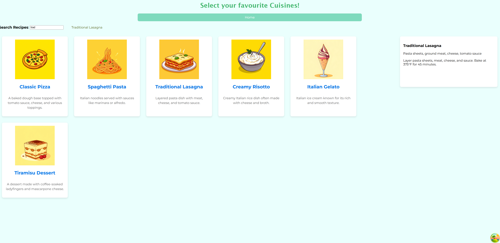

# 🍽️ Food Recipes

Food Recipes is a web application that allows users to explore popular cuisines and select specific dishes to discover their recipes. The project includes a search functionality to find particular dishes within a selected cuisine, making it an easy and engaging tool for food enthusiasts.

## 📸 Screenshots

### Page Showing Dishes Under a Cuisine:

### Page Showing Dishes Under a Cuisine:

### Page Showing Recipe Details for a Selected Dish:

---

## 🚀 Features

- Explore dishes categorized by different cuisines.
- Search for specific dishes within a cuisine.
- View detailed recipes for selected dishes.
- Simple and intuitive user interface for easy navigation.

---

## 🔧 Tech Stack

- **Frontend:** React, JavaScript, CSS
- **Backend:** Node.js, Express.js
- **Database:** SQLite3
- **Development Tools:** Knex.js

---

## 🛠 Project Details

### Development Team:
This project was collaboratively developed by a team of three members. We worked together to design and implement the frontend, backend, and database layers.

### My Role:
- Focused on server-side development.
- Created seed data and managed database tables.
- Developed backend routes and database query functions.

---

## 🚀 Deployment Status:
The project has not been deployed yet, but you can explore its functionality through the provided screenshots.
